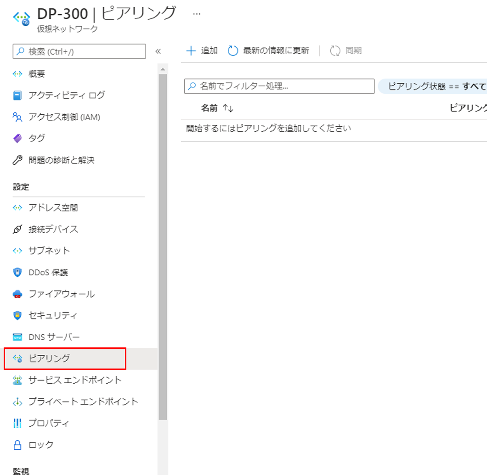

---
Exercise:
  title: M01-ユニット 8 グローバル仮想ネットワーク ピアリングを使用して 2 つの Azure 仮想ネットワークを接続する
  module: Module - Introduction to Azure Virtual Networks
ms.openlocfilehash: 934ebb601aa0fb8a66b9493d1cb4b5d913005482
ms.sourcegitcommit: cc6b12857d97b72310f349592f5d4adbd371cc50
ms.translationtype: HT
ms.contentlocale: ja-JP
ms.lasthandoff: 02/10/2022
ms.locfileid: "138422791"
---
# <a name="m01-unit-8-connect-two-azure-virtual-networks-using-global-virtual-network-peering"></a>M01-ユニット 8 グローバル仮想ネットワーク ピアリングを使用して 2 つの Azure 仮想ネットワークを接続する

## <a name="exercise-scenario"></a>演習のシナリオ 
このユニットでは、トラフィック フローを許可するピアリングを追加することにより、CoreServicesVnet と ManufacturingVnet の間の接続を構成します。 

このユニットでは、次のことを行います。

+ タスク 1: 構成をテストするための仮想マシンを作成する
+ タスク 2: RDP を使用してテスト VM に接続する
+ タスク 3: VM 間の接続をテストする
+ タスク 4: CoreServicesVnet と ManufacturingVnet の間に VNet ピアリングを作成する
+ タスク 5: VM 間の接続をテストする
+ タスク 6: リソースをクリーンアップする

## <a name="task-1-create-a-virtual-machine-to-test-the-configuration"></a>タスク 1: 構成をテストするための仮想マシンを作成する

このセクションでは、ManufacturingVnet 上にテスト VM を作成し、ManufacturingVnet から別の Azure 仮想ネットワーク内のリソースにアクセスできるかどうかをテストします。

### <a name="create-manufacturingvm"></a>ManufacturingVM を作成する

1. Azure portal で、**[Cloud Shell]** ペイン内に **PowerShell** セッションを開きます。

2. [Cloud Shell] ウィンドウのツール バーで、[ファイルのアップロード/ダウンロード] アイコンを選択し、ドロップダウン メニューで [アップロード] を選択して、**ManufacturingVMazuredeploy.json** および **ManufacturingVMazuredeploy.parameters.json** の各ファイルをソース フォルダー **F:\Allfiles\Exercises\M01** から Cloud Shell のホーム ディレクトリにアップロードします。

3. 次の ARM テンプレートをデプロイして、この演習に必要な VM を作成します。

   ```powershell
   $RGName = "ContosoResourceGroup"
   
   New-AzResourceGroupDeployment -ResourceGroupName $RGName -TemplateFile ManufacturingVMazuredeploy.json -TemplateParameterFile ManufacturingVMazuredeploy.parameters.json
   ```
  
4. デプロイが完了したら、Azure portal のホーム ページに移動し、**[仮想マシン]** を選択します。

5. 仮想マシンが作成されていることを確認してください。

## <a name="task-2-connect-to-the-test-vms-using-rdp"></a>タスク 2: RDP を使用してテスト VM に接続する

1. Azure portal のホーム ページで、「**仮想マシン**」を選択します。

2. **ManufacturingVM** を選択します。

3. ManufacturingVM で、**[接続] &gt; [RDP]** を選択します。

4. [ManufacturingVM | 接続] で、**[RDP ファイルのダウンロード]** を選択します。

5. RDP ファイルをデスクトップに保存します。

6. この RDP ファイル、**TestUser** のユーザー名、**TestPa$$w0rd!** のパスワードを使用し、ManufacturingVM に接続します。

7. Azure portal のホーム ページで、「**仮想マシン**」を選択します。

8. **TestVM1** を選択します。

9. TestVM1 で、**[接続] &gt; [RDP]** を選択します。

10. [TestVM1 | 接続] で、**[RDP ファイルのダウンロード]** を選択します。

11. RDP ファイルをデスクトップに保存します。

12. この RDP ファイルと、ユーザー名 **TestUser**、パスワード **TestPa$$w0rd!** を使って TestVM1 に接続します。

13. 両方の VM で、**[デバイスのプライバシー設定の選択]** の **[同意する]** を選択します。

14. 両方の VM で、**[ネットワーク]** の **[はい]** を選択します。

15. TestVM1 で PowerShell プロンプトを開き、次のコマンドを実行します: ipconfig

16. IPv4 アドレスを記録しておきます。 

 

## <a name="task-3-test-the-connection-between-the-vms"></a>タスク 3: VM 間の接続をテストする

1. ManufacturingVM で、PowerShell プロンプトを開きます。

2. 次のコマンドを使用して、CoreServicesVnet 上の TestVM1 への接続がないことを確認します。 TestVM1 には必ず IPv4 アドレスを使用してください。

   ```powershell
    Test-NetConnection 10.20.20.4 -port 3389
    ```


3. テスト接続が失敗すると、次のような結果が表示されます。

 

## <a name="task-4-create-vnet-peerings-between-coreservicesvnet-and-manufacturingvnet"></a>タスク 4: CoreServicesVnet と ManufacturingVnet の間に VNet ピアリングを作成する

1. Azure のホーム ページで **[仮想ネットワーク]** を選択し、**CoreServicesVnet** を選択します。

2. CoreServicesVnet の **[設定]** で、**[ピアリング]** を選択します。
   

3. [CoreServicesVnet |ピアリング] で、**[+ 追加]** を選択します。

4. 次の表の情報を使用して、ピアリングを作成します。

| **セクション**                          | **オプション**                                    | **Value**                             |
| ------------------------------------ | --------------------------------------------- | ------------------------------------- |
| この仮想ネットワーク                 |                                               |                                       |
|                                      | [Peering link name]\(ピアリング リンク名\)                             | CoreServicesVnet-to-ManufacturingVnet |
|                                      | [Traffic to remote virtual network]\(リモート仮想ネットワークへのトラフィック\)             | 許可 (既定)                       |
|                                      | [Traffic forwarded from remote virtual network](リモート仮想ネットワークから転送されるトラフィック) | 許可 (既定)                       |
|                                      | 仮想ネットワーク ゲートウェイまたは Route Server       | なし (既定値)                        |
| リモート仮想ネットワーク               |                                               |                                       |
|                                      | [Peering link name]\(ピアリング リンク名\)                             | ManufacturingVnet-to-CoreServicesVnet |
|                                      | 仮想ネットワークのデプロイ モデル              | Resource Manager                      |
|                                      | リソース ID を知っている                         | オフ                          |
|                                      | サブスクリプション                                  | MOC Subscription-lodxxxxxxxx          |
|                                      | 仮想ネットワーク                               | ManufacturingVnet                     |
|                                      | [Traffic to remote virtual network]\(リモート仮想ネットワークへのトラフィック\)             | 許可 (既定)                       |
|                                      | [Traffic forwarded from remote virtual network](リモート仮想ネットワークから転送されるトラフィック) | 許可 (既定)                       |
|                                      | 仮想ネットワーク ゲートウェイまたは Route Server       | なし (既定値)                        |
| 設定を確認し、[追加] を選択します。 |                                               |                                       |
|                                      |                                               |                                       |


5. [CoreServicesVnet | ピアリング] で、**CoreServicesVnet-to-ManufacturingVnet** ピアリングが一覧に表示されることを確認します。

6. [仮想ネットワーク] で **ManufacturingVnet** を選択し、**ManufacturingVnet-to-CoreServicesVnet** ピアリングが一覧に表示されることを確認します。

 

## <a name="task-5-test-the-connection-between-the-vms"></a>タスク 5: VM 間の接続をテストする

1. ManufacturingVM で、PowerShell プロンプトを開きます。

2. 次のコマンドを使用して、今度は CoreServicesVnet 上の TestVM1 への接続があることを確認します。 

   ```powershell
    Test-NetConnection 10.20.20.4 -port 3389
    ```


3. テスト接続が成功すると、次のような結果が表示されます。

 

お疲れさまでした。 ピアリングを追加することで、VNet 間の接続が正常に構成されました。 

## <a name="task-6-clean-up-resources"></a>タスク 6: リソースをクリーンアップする

   >**注**:新規に作成し、使用しなくなったすべての Azure リソースを削除することを忘れないでください。 使用していないリソースを削除することで、予期しない料金が発生しなくなります。

1. Azure portal で、**[Cloud Shell]** ペイン内に **PowerShell** セッションを開きます。 (必要に応じて、既定の設定を使って Cloud Shell ストレージを作成します)。

1. 次のコマンドを実行して、このモジュールのラボ全体を通して作成したすべてのリソース グループを削除します。

   ```powershell
   Remove-AzResourceGroup -Name 'ContosoResourceGroup' -Force -AsJob
   ```

    >**注**:このコマンドは非同期で実行されるため (-AsJob パラメーターによって決定されます)、同じ PowerShell セッション内で直後に別の PowerShell コマンドを実行できますが、リソース グループが実際に削除されるまでに数分かかります。
