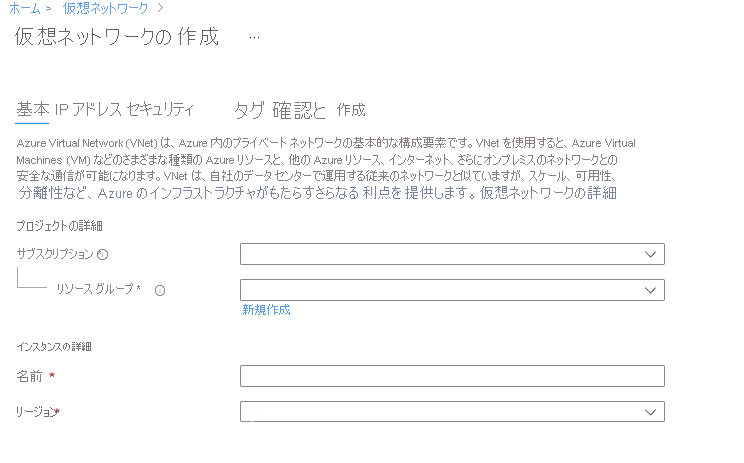
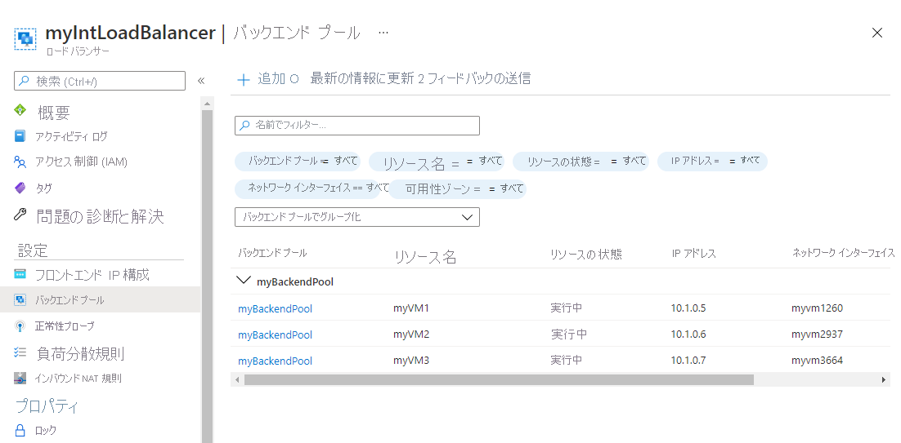
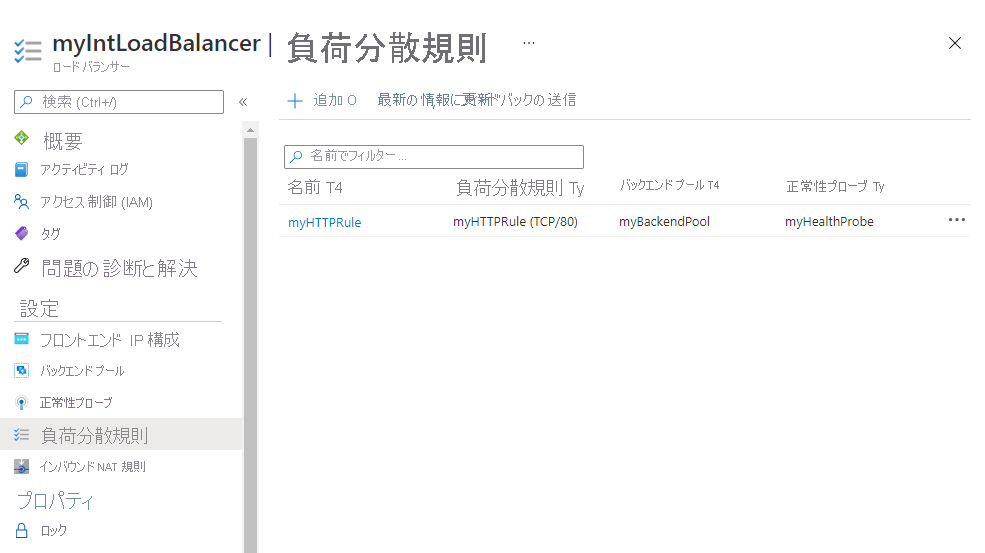

---
Exercise:
  title: M04-ユニット 4 Azure Load Balancer を作成および構成する
  module: Module - Load balancing non-HTTP(S) traffic in Azure
ms.openlocfilehash: 1c34cac1a578662e40265f387b4579b6171b4d13
ms.sourcegitcommit: 3aeb76a0ac28b33b6edc61365b303f5b0252a3c2
ms.translationtype: HT
ms.contentlocale: ja-JP
ms.lasthandoff: 01/30/2022
ms.locfileid: "137860530"
---
# <a name="m04-unit-4-create-and-configure-an-azure-load-balancer"></a>M04-ユニット 4 Azure Load Balancer を作成および構成する

この演習では、架空の組織 Contoso Ltd. 用の内部ロード バランサーを作成します。 

内部ロード バランサーを作成する手順は、このモジュールで既に学習した、パブリック ロード バランサーを作成する手順とよく似ています。 主な違いは、パブリック ロード バランサーでは、フロントエンドにはパブリック IP アドレスを使用してアクセスされ、仮想ネットワークの外部に配置されているホストから接続をテストしますが、一方で内部ロード バランサーでは、フロントエンドは仮想ネットワーク内のプライベート IP アドレスであり、同じネットワーク内のホストから接続をテストします。

次の図は、この演習でデプロイする環境を示しています。


 
この演習では、以下のことを行います。

+ タスク 1: 仮想ネットワークを作成する
+ タスク 2: バックエンド サーバーを作成する
+ タスク 3: ロード バランサーを作成する
+ タスク 4: ロード バランサーのリソースを作成する
+ タスク 5: ロード バランサーをテストする

## <a name="task-1-create-the-virtual-network"></a>タスク 1: 仮想ネットワークを作成する

このセクションでは、仮想ネットワークとサブネットを作成します。
   
1. Azure ポータルにログインします。

2. Azure portal のホーム ページで、グローバル検索バーに移動し、「**仮想ネットワーク**」を検索して、[サービス] の下の仮想ネットワークを選択します。  

3. 仮想ネットワーク ページで、**[作成]** を選択します。  

4. **[基本]** タブで、次の表の情報を使用して仮想ネットワークを作成します。

   | **設定**    | **Value**                                  |
   | -------------- | ------------------------------------------ |
   | サブスクリプション   | サブスクリプションを選択します。                   |
   | Resource group | **[新規作成]** を選択  名前: **IntLB-RG** |
   | 名前           | **IntLB-VNet**                             |
   | リージョン         | **(米国) 米国東部**                           |


5. **[Next : IP Addresses]\(次へ: IP アドレス\)** をクリックします。

6. **[IP アドレス]** タブの **[IPv4 アドレス空間]** ボックスで、既定値を削除してから「**10.1.0.0/16**」と入力します。

7. **[IP アドレス]** タブで **[+ サブネットの追加]** を選択します。

8. **[サブネットの追加]** ペインで、サブネット名を **myBackendSubnet** に、サブネット アドレス範囲を **10.1.0.0/24** に設定します。

9. **[追加]** をクリックします。

10. **「サブネットの追加」** で、 **「myFrontEndSubnet」** のサブネット名と **「10.1.2.0/24」** のサブネット アドレス範囲を指定します。 **[追加]** をクリックします。

11. **[Next : Security]\(次へ: セキュリティ\)** をクリックします。

12. **[BastionHost]** で、**[有効化]** を選択し、以下の表の情報を入力します。

    | **設定**                       | **Value**                                     |
    | --------------------------------- | --------------------------------------------- |
    | 要塞名                      | **myBastionHost**                             |
    | [AzureBastionSubnet のアドレス空間] | **10.1.1.0/24**                               |
    | パブリック IP アドレス                 | **[新規作成]** を選択  名前: **myBastionIP** |


13. **[Review + create]\(レビュー + 作成\)** をクリックします。

14. **Create** をクリックしてください。

## <a name="task-2-create-backend-servers"></a>タスク 2: バックエンド サーバーを作成する

このセクションでは、ロード バランサーのバックエンド プールに対して同じ可用性セットに含まれる 3 つの VM を作成し、それらの VM をバックエンド プールに追加してから、3 つの VM に IIS をインストールしてロード バランサーをテストします。

1. Azure portal で、**[Cloud Shell]** ペイン内に **PowerShell** セッションを開きます。

2. [Cloud Shell] ペインのツールバーで、[ファイルのアップロード/ダウンロード] アイコンをクリックし、ドロップダウン メニューで [アップロード] をクリックして、azuredeploy.json、azuredeploy.parameters.vm1.json、azuredeploy.parameters.vm2.json、azuredeploy.parameters.vm3.json の各ファイルを Cloud Shell のホーム ディレクトリにアップロードします。

3. 次の ARM テンプレートをデプロイして、この演習に必要な仮想ネットワーク、サブネット、VM を作成します。

   ```powershell
   $RGName = "IntLB-RG"
   
   New-AzResourceGroupDeployment -ResourceGroupName $RGName -TemplateFile azuredeploy.json -TemplateParameterFile azuredeploy.parameters.vm1.json
   New-AzResourceGroupDeployment -ResourceGroupName $RGName -TemplateFile azuredeploy.json -TemplateParameterFile azuredeploy.parameters.vm2.json
   New-AzResourceGroupDeployment -ResourceGroupName $RGName -TemplateFile azuredeploy.json -TemplateParameterFile azuredeploy.parameters.vm3.json
   ```

## <a name="task-3-create-the-load-balancer"></a>タスク 3: ロード バランサーを作成する

このセクションでは、Standard SKU の内部ロード バランサーを作成します。 この演習で、Basic SKU のロード バランサーではなく、Standard SKU のロード バランサーを作成する理由は、後の演習で Standard SKU バージョンのロード バランサーが必要となるためです。

1. Azure portal のホーム ページで、**[リソースの作成]** を選択します。

2. ページ上部の検索ボックスに「**Load Balancer**」と入力し、**Enter** キーを押します。(**注:** 一覧からは選択しないでください)。

3. 結果ページで、**[ロード バランサー]** (名前の下に "Microsoft" と "Azure Service" と表示されているもの) を見つけ、選択します。

4. **[作成]** をクリックします。
   

5. **[基本]** タブで、以下の表の情報を使用して、ロード バランサーを作成します。

   | **設定**           | **Value**                |
   | --------------------- | ------------------------ |
   | サブスクリプション          | サブスクリプションを選択します。 |
   | Resource group        | **IntLB-RG**             |
   | Name                  | **myIntLoadBalancer**    |
   | リージョン                | **(米国) 米国東部**         |
   | Type                  | **内部**             |
   | SKU                   | **Standard**             |


6. **[次へ: フロントエンド IP 構成]** をクリックします。
7. [フロントエンド IP の追加] をクリックします。
8. **[フロントエンド IP アドレスの追加]** ウィンドウで、以下の表の情報を入力します。
 
   | **設定**     | **Value**                |
   | --------------- | ------------------------ |
   | 名前            | **LoadBalancerFrontEnd** |
   | 仮想ネットワーク | **IntLB-VNet**           |
   | Subnet          | **myFrontEndSubnet**     |
   | 割り当て      | **動的**              |

9. **[Review + create]\(レビュー + 作成\)** をクリックします。

10. **Create** をクリックしてください。

## <a name="task-4-create-load-balancer-resources"></a>タスク 4: ロード バランサーのリソースを作成する

このセクションでは、バックエンド アドレス プールのロード バランサー設定を構成し、正常性プローブとロード バランサーの規則を指定します。

### <a name="create-a-backend-pool-and-add-vms-to-the-backend-pool"></a>バックエンド プールを作成してバックエンド プールに VM を追加する

バックエンド アドレス プールには、ロード バランサーに接続された仮想 NIC の IP アドレスが含まれています。

1. Azure portal のホームページで、**[すべてのリソース]** をクリックし、リソースの一覧から **[myIntLoadBalancer]** をクリックします。

2. **[設定]** で、**[バックエンド プール]** を選択し、**[追加]** をクリックします。

3. **[バックエンド プールの追加]** ページで、以下の表の情報を入力します。

   | **設定**     | **Value**            |
   | --------------- | -------------------- |
   | 名前            | **myBackendPool**    |
   | 仮想ネットワーク | **IntLB-VNet**       |


4. **[仮想マシン]** で、**[追加]** をクリックします。

5. 3 つの VM (**myVM1**、**myVM2**、**myVM3**) のチェックボックスをオンにし、**[追加]** をクリックします。

6. **[追加]** をクリックします。
   
   

### <a name="create-a-health-probe"></a>正常性プローブの作成

ロード バランサーは、正常性プローブを使用してアプリの状態を監視します。 正常性プローブは、正常性チェックへの応答に基づいて、ロード バランサーに含める VM を追加したり削除したりします。 ここでは、正常性プローブを作成して、VM の正常性を監視します。

1. **[設定]** で **[正常性プローブ]** をクリックし、 **[追加]** をクリックします。

2. **[正常性プローブの追加]** ページで、次の表の情報を入力します。

   | **設定**         | **Value**         |
   | ------------------- | ----------------- |
   | 名前                | **myHealthProbe** |
   | Protocol            | **HTTP**          |
   | Port                | **80**            |
   | パス                | **/**             |
   | Interval            | **15**            |
   | 異常のしきい値 | **2**             |


3. **[追加]** をクリックします。
   

 

### <a name="create-a-load-balancer-rule"></a>ロード バランサー規則の作成

ロード バランサー規則の目的は、一連の VM に対するトラフィックの分散方法を定義することです。 着信トラフィック用のフロントエンド IP 構成と、トラフィックを受信するためのバックエンド IP プールを定義します。 送信元と送信先のポートは、この規則で定義します。 ここでは、ロード バランサーの規則を作成します。

1. ロード バランサーの **[バックエンド プール]** ページの **[設定]** で、**[負荷分散規則]** をクリックし、**[追加]** をクリックします。

2. **[負荷分散規則の追加]** ページで、次の表の情報を入力します。

   | **設定**            | **Value**                |
   | ---------------------- | ------------------------ |
   | 名前                   | **myHTTPRule**           |
   | IP バージョン             | **IPv4**                 |
   | フロントエンド IP アドレス    | **LoadBalancerFrontEnd** |
   | Protocol               | **TCP**                  |
   | Port                   | **80**                   |
   | バックエンド ポート           | **80**                   |
   | バックエンド プール           | **myBackendPool**        |
   | 正常性プローブ           | **myHealthProbe**        |
   | セッション永続化    | **なし**                 |
   | アイドル タイムアウト (分) | **15**                   |
   | フローティング IP            | **無効**             |


3. **[追加]** をクリックします。
   

 


 

 

## <a name="task-5-test-the-load-balancer"></a>タスク 5: ロード バランサーをテストする

このセクションでは、テスト VM を作成し、ロード バランサーをテストします。

### <a name="create-test-vm"></a>テスト VM を作成する

1. Azure portal のホーム ページで、**[リソースの作成]**、**[Compute]** の順にクリックし、**[仮想マシン]** を選択します (このリソースの種類がページに表示されていない場合は、ページの上部にある [検索] ボックスを使用してそれを検索し、選択します)。

2. **[仮想マシンの作成]** ページの **[基本]** タブで、以下の表の情報を使用して最初の VM を作成します。

   | **設定**          | **Value**                                    |
   | -------------------- | -------------------------------------------- |
   | サブスクリプション         | サブスクリプションを選択します。                     |
   | Resource group       | **IntLB-RG**                                 |
   | 仮想マシン名 | **myTestVM**                                 |
   | リージョン               | **(米国) 米国東部**                             |
   | 可用性のオプション | **インフラストラクチャの冗長性は必要ありません**    |
   | Image                | **[Windows Server 2019 Datacenter - Gen 1]**   |
   | サイズ                 | **Standard_DS2_v3 - 2 vcpu、8 GiB メモリ** |
   | ユーザー名             | **TestUser**                                 |
   | Password             | **TestPa$$w0rd!**                            |
   | [パスワードの確認入力]     | **TestPa$$w0rd!**                            |


3. **[Next : Disks]\(次へ: ディスク\)** をクリックし、**[Next : Networking]\(次へ: ネットワーク\)** をクリックします。 

4. **[ネットワーク]** タブで、以下の表の情報を使用してネットワーク設定を構成します。

   | **設定**                                                  | **Value**                     |
   | ------------------------------------------------------------ | ----------------------------- |
   | 仮想ネットワーク                                              | **IntLB-VNet**                |
   | Subnet                                                       | **myBackendSubnet**           |
   | パブリック IP                                                    | **[なし]** に変更する            |
   | NIC ネットワーク セキュリティ グループ                                   | **詳細**                  |
   | ネットワーク セキュリティ グループを構成する                             | 既存の **[myNSG]** を選択します |
   | この仮想マシンを既存の負荷分散ソリューションの後ろに配置しますか? | **[オフ]** (チェック解除)           |


5. **[Review + create]\(レビュー + 作成\)** をクリックします。

6. **Create** をクリックしてください。

7. 次のタスクに進む前に、この最後の VM がデプロイされるのを待ちます。

### <a name="connect-to-the-test-vm-to-test-the-load-balancer"></a>テスト VM に接続してロード バランサーをテストする

1. Azure portal のホームページで、**[すべてのリソース]** をクリックし、リソースの一覧から **[myIntLoadBalancer]** をクリックします。

2. **[概要]** ページで、**プライベート IP アドレス** をメモするか、クリップボードにコピーします。 注: **[プライベート IP アドレス]** フィールドを表示するには、 **[もっと見る]** を選択しなくてはならない場合があります。

3. **[ホーム]** をクリックし、Azure portal ページで **[すべてのリソース]** をクリックして、先ほど作成した **myTestVM** 仮想マシンをクリックします。

4. **[概要]** ページで **[接続]** 、 **[要塞]** の順に選択します。

5. **[Bastion を使用する]** をクリックします。

6. **[ユーザー名]** ボックスに「**TestUser**」と入力し、**[パスワード]** ボックスに「**TestPa$$w0rd!**」と入力して、**[接続]** をクリックします。

7. **[myTestVM]** ウィンドウが別のブラウザー タブで開きます。

8. **[ネットワーク]** ペインが表示されたら、**[はい]** をクリックします。

9. タスク バーの **Internet Explorer** アイコンをクリックして、Web ブラウザーを開きます。

10. **[Internet Explorer 11 の設定]** ダイアログ ボックスで、**[OK]** をクリックします。

11. 前の手順の **プライベート IP アドレス** (例: 10.1.0.4) をブラウザーのアドレス バーに入力し (または貼り付け)、Enter キーを押します。

12. IIS Web サーバーの既定の Web ホーム ページがブラウザー ウィンドウに表示されます。 バックエンド プール内の 3 つの仮想マシンの 1 つによって応答が返されます。
    

13. ブラウザーで更新ボタンを数回クリックすると、内部ロード バランサーのバックエンド プール内の異なる VM からランダムに応答が返されるのを確認できます。
    

## <a name="clean-up-resources"></a>リソースをクリーンアップする

   >**注**:新規に作成し、使用しなくなったすべての Azure リソースを削除することを忘れないでください。 使用していないリソースを削除することで、予期しない料金が発生しなくなります。

1. Azure portal で、**[Cloud Shell]** ペイン内に **PowerShell** セッションを開きます。

1. 次のコマンドを実行して、このモジュールのラボ全体を通して作成したすべてのリソース グループを削除します。

   ```powershell
   Remove-AzResourceGroup -Name 'IntLB-RG' -Force -AsJob
   ```

    >**注**:このコマンドは非同期で実行されるため (-AsJob パラメーターによって決定されます)、同じ PowerShell セッション内で直後に別の PowerShell コマンドを実行できますが、リソース グループが実際に削除されるまでに数分かかります。
