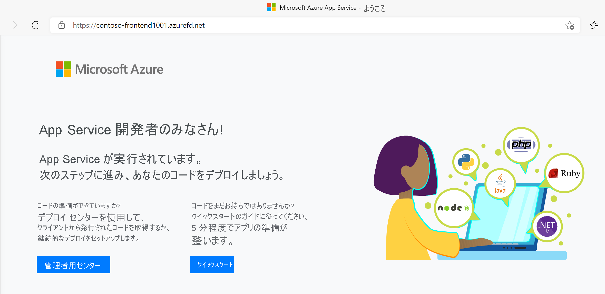
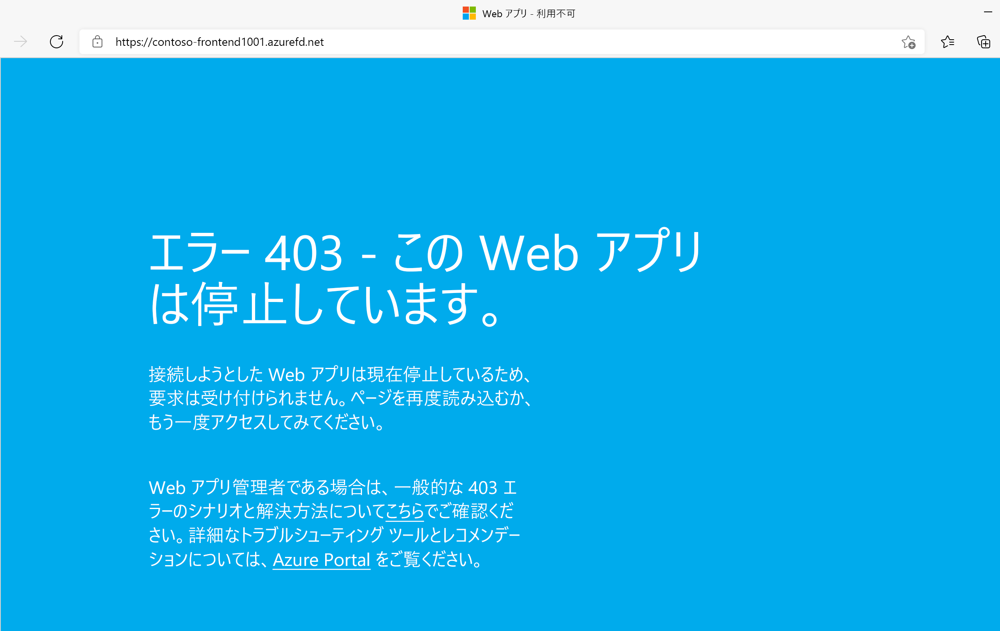

---
Exercise:
  title: M05-ユニット 6 Azure portal を使用して高可用性 Web アプリケーションのフロント ドアを作成する
  module: Module - Load balancing HTTP(S) traffic in Azure
ms.openlocfilehash: 78a6ba6417aa6c43e2e613af8c20c5d76c4749c0
ms.sourcegitcommit: 3aeb76a0ac28b33b6edc61365b303f5b0252a3c2
ms.translationtype: HT
ms.contentlocale: ja-JP
ms.lasthandoff: 01/30/2022
ms.locfileid: "137860535"
---
# <a name="m05-unit-6-create-a-front-door-for-a-highly-available-web-application-using-the-azure-portal"></a>M05-ユニット 6 Azure portal を使用して高可用性 Web アプリケーションのフロント ドアを作成する

 

この演習では、別々の Azure リージョンで実行される、Web アプリケーションの 2 つのインスタンスをプールする Azure Front Door の構成を設定します。 この構成では、アプリケーションが実行されている最も近いサイトにトラフィックが誘導されます。 Web アプリケーションは、Azure Front Door によって絶えず監視されます。 最も近いサイトが利用できなくなったときに、使用可能な次のサイトに自動フェールオーバーする方法について説明します。 次の図に、ネットワーク構成を示します。


この演習では、以下のことを行います。

+ タスク 1: Web アプリの 2 つのインスタンスを作成する
+ タスク 2: アプリケーション用のフロント ドアを作成する
+ タスク 3: Azure Front Door の動作を確認する
+ タスク 4: リソースをクリーンアップする


## <a name="task-1-create-two-instances-of-a-web-app"></a>タスク 1: Web アプリの 2 つのインスタンスを作成する

この演習には、別々の Azure リージョンで実行される、Web アプリケーションの 2 つのインスタンスが必要です。 どちらの Web アプリケーション インスタンスもアクティブ/アクティブ モードで実行されるため、どちらでもトラフィックを受け入れることができます。 この構成は、一方がフェールオーバーとして機能するアクティブ/スタンバイ構成とは異なります。

1. Azure Portal [https://portal.azure.com](https://portal.azure.com/) にサインインします。

2. Azure ホーム ページのグローバル検索で、「**WebApp**」と入力し、[サービス] の下の **[App Services]** を選択します。

3. **[+ 作成]** をクリックして、Web アプリを作成します。

4. [Web アプリの作成] ページの **[基本]** タブで、次の情報を入力または選択します。

   | **設定**      | **Value**                                                    |
   | ---------------- | ------------------------------------------------------------ |
   | サブスクリプション     | サブスクリプションを選択します。                                    |
   | Resource group   | リソース グループ ContosoResourceGroup を選択する               |
   | Name             | Web アプリの一意の名前を入力します。 この例では WebAppContoso-1 を使用します。 |
   | 発行          | **[コード]** を選択します。                                             |
   | ランタイム スタック    | **[.NET Core 3.1 (LTS)]** を選択します。                              |
   | オペレーティング システム | **[Windows]** を選択します。                                          |
   | リージョン           | **[米国中部]** を選択します。                                       |
   | Windows プラン     | **[新規作成]** を選択し、テキスト ボックスに「myAppServicePlanCentralUS」と入力します。 |
   | SKU とサイズ     | **[Standard S1 100 total ACU, 1.75 GB memory]\(Standard S1 合計 100 ACU、1.75 GB メモリ\)** を選択します。        |

5. **[確認および作成]** を選択し、[概要] を確認して、**[作成]** を選択します。   
   ‎デプロイが完了するまでに数分かかる場合があります。

6. 2つ目の Web アプリを作成します。 Azure portal のホーム ページで、**WebApp** を検索します。

7. **[+ 作成]** をクリックして、Web アプリを作成します。

8. [Web アプリの作成] ページの **[基本]** タブで、次の情報を入力または選択します。

   | **設定**      | **Value**                                                    |
   | ---------------- | ------------------------------------------------------------ |
   | サブスクリプション     | サブスクリプションを選択します。                                    |
   | Resource group   | リソース グループ ContosoResourceGroup を選択する               |
   | Name             | Web アプリの一意の名前を入力します。 この例では WebAppContoso-2 を使用します。 |
   | 発行          | **[コード]** を選択します。                                             |
   | ランタイム スタック    | **[.NET Core 3.1 (LTS)]** を選択します。                              |
   | オペレーティング システム | **[Windows]** を選択します。                                          |
   | リージョン           | **[米国東部]** を選択します。                                          |
   | Windows プラン     | **[新規作成]** を選択し、テキスト ボックスに「myAppServicePlanEastUS」と入力します。 |
   | SKU とサイズ     | **[Standard S1 100 total ACU, 1.75 GB memory]\(Standard S1 合計 100 ACU、1.75 GB メモリ\)** を選択します。        |

9. **[確認および作成]** を選択し、[概要] を確認して、**[作成]** を選択します。   
   ‎デプロイが完了するまでに数分かかる場合があります。

## <a name="task-2-create-a-front-door-for-your-application"></a>タスク 2: アプリケーション用のフロント ドアを作成する

2 つの Web アプリ サーバーのうち待ち時間が短い方にユーザー トラフィックを誘導するように Azure Front Door を構成します。 最初に、Azure Front Door のフロントエンド ホストを追加します。

1. Azure portal ページの「**リソース、サービス、ドキュメントの検索 (G+/)** 」で、Front Doors と入力し、結果から「**Front Doors**」を選択します。

   

2. [フロント ドア] ページで、**[+ 作成]** を選択します。

3. [Create a Front Door]\(フロント ドアの作成\) で、次の情報を入力または選択します。

   | **設定**             | **Value**                                    |
   | ----------------------- | -------------------------------------------- |
   | サブスクリプション            | サブスクリプションを選択します。                    |
   | Resource group          | [ContosoResourceGroup] を選択します                  |
   | リソース グループの場所 | 既定の設定を使用します                       |

4. **[Next:構成]** を選択します。

5. [構成] タブの **[Frontends/domains]\(フロントエンド/ドメイン\)** で、**+** を選択してフロントエンド ホストを追加します。

   ![[Create a Front Door]\(フロント ドアの作成\) でフロントエンド/ドメインを追加する](../media/add-frontends-domains.png)

6. グローバルに一意の **ホスト名** (例: contoso-frontend) を入力し、**[追加]** を選択します。

7. 次に、2 つの Web アプリを含んだバックエンド プールを作成します。  
   ‎[Create a Front Door]\(フロント ドアの作成\) の **[バックエンド プール]** で、[+] を選択してバックエンド プールを追加します。

   ![[Create a Front Door]\(フロント ドアの作成\) でバックエンド プールを追加する](../media/add-backends.png)

8. ホスト名を入力します (**BackendPool** など)。

9. **[バックエンド]** で、**[+ バックエンドの追加]** を選択します。

10. [バックエンドの追加] で、次の情報を入力または選択します。

    | **設定**       | **Value**                                                    |
    | ----------------- | ------------------------------------------------------------ |
    | バックエンド ホストの種類 | **[App Service]** を選択します。                                      |
    | サブスクリプション      | サブスクリプションを選択します。                                    |
    | バックエンド ホスト名 | 最初に作成した Web アプリを選択します。 この例では、**WebAppContoso-1** という Web アプリが該当します。 |

11. 他のフィールドはすべて既定値のままにして、**[追加]** を選択します。

12. **[+ バックエンドの追加]** をもう一度選択し、次のように入力または選択します。

    | **設定**       | **Value**                                                    |
    | ----------------- | ------------------------------------------------------------ |
    | バックエンド ホストの種類 | [App Service] を選択します。                                          |
    | サブスクリプション      | サブスクリプションを選択します。                                    |
    | バックエンド ホスト名 | 作成した 2 つ目の Web アプリを選択します。 この例では、**WebAppContoso-2** という Web アプリが該当します。 |

13. 他のフィールドはすべて既定値のままにして、**[追加]** を選択します。

14. **[バックエンド** **プールの追加]** ブレードで **[追加]** を選択して、バックエンドプールの構成を完了します。

15. 最後に、ルーティング規則を追加します。 フロントエンド ホストは、ルーティング規則によってバックエンド プールにマップされます。 この規則によって、contoso-frontend.azurefd.net に対する要求が myBackendPool に転送されます。

16. [Create a Front Door]\(フロントドアの作成\) の **[ルーティング規則]** で、**+** を選択してルーティング規則を構成します。

    ![[Create a Front Door]\(フロント ドアの作成\) でルーティング規則を追加する](../media/add-routing-rules.png)

17. [規則を追加する] の **[名前]** に「LocationRule」と入力します。 

18. すべて既定値のままにし、 **[追加]** を選択してルーティング規則を追加します。

19. **[確認および作成]** 、 **[作成]** の順に選択します。

**Front Door 内の各フロントエンド ホストに、既定のパス (\*) が関連付けられたルーティング規則があることを確認する必要があります。つまり、すべてのルーティング規則について、既定のパス (\*) で定義された各フロントエンド ホストに対するルーティング規則が少なくとも 1 つは存在する必要があります。そうなっていないと、エンドユーザーのトラフィックが正しくルーティングされない可能性があります**。

 

## <a name="task-3-view-azure-front-door-in-action"></a>タスク 3: Azure Front Door の動作を確認する

フロント ドアを作成した後、グローバルに構成がデプロイされるまでに数分かかります。 完了したら、作成したフロントエンド ホストにアクセスします。 

1. Azure portal で、Front Door フロントエンドに移動します。 **[リソースに移動]** を選択します。 または、[リソース、サービス、ドキュメントの検索 (G+/)] に「**フロント ドア**」と入力し、結果から **[フロント ドア]** を選択して、目的のフロント ドアを選択します。

2. [フロント ドア] ページで、**フロントエンド ホスト** の URL を書き留めます。 この演習では contoso-frontend.azurefd.net を使用していますが、名前が一意になるように変更している可能性があります。

   

3. ブラウザーで、フロントエンド ホストの URL (contoso-frontend.azurefd.net) にアクセスします。 要求は、バックエンド プール内の指定されたサーバーの中から、自分に最も近いサーバーに自動的にルーティングされます。

4. 次の情報ページが表示されます。

   

5. 即時グローバル フェールオーバーの動作をテストするために、次の手順を試してみましょう。

6. Azure portal に切り替えて、**App Services** を検索して選択します。 

7. いずれかの Web アプリを選択し、**[停止]** を選択し、**[はい]** を選択して確認します。

   

8. ブラウザーに戻り、[最新の情報に更新] を選択します。 同じ情報ページが表示されるはずです。

**Web アプリが停止している間に遅延が発生する場合があります。ブラウザーにエラー ページが表示された場合は、ページを最新の情報に更新してください**。

1. Azure portal に戻り、他の Web アプリを見つけて、停止します。

2. ブラウザーに戻り、[最新の情報に更新] を選択します。 今回はエラー メッセージが表示されます。

   

   お疲れさまでした。 これで、Azure Front Door の構成とテストが完了しました。
   
  
   
   ## <a name="task-4-clean-up-resources"></a>タスク 4: リソースをクリーンアップする
   
   >**注**:新規に作成し、使用しなくなったすべての Azure リソースを削除することを忘れないでください。 使用していないリソースを削除することで、予期しない料金が発生しなくなります。

1. Azure portal で、**[Cloud Shell]** ペイン内に **PowerShell** セッションを開きます。

1. 次のコマンドを実行して、このモジュールのラボ全体を通して作成したすべてのリソース グループを削除します。

   ```powershell

   Remove-AzResourceGroup -Name 'ContosoResourceGroup' -Force -AsJob

   ```

    >**注**:このコマンドは非同期で実行されるため (-AsJob パラメーターによって決定されます)、同じ PowerShell セッション内で直後に別の PowerShell コマンドを実行できますが、リソース グループが実際に削除されるまでに数分かかります。
