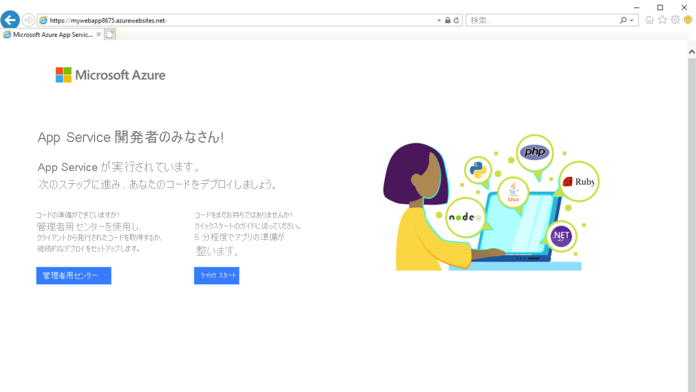

---
Exercise:
  title: M07 - ユニット 6 Azure PowerShell を使用して Azure プライベート エンドポイントを作成する
  module: Module 07 - Design and implement private access to Azure Services
---

# <a name="m07-unit-6-create-an-azure-private-endpoint-using-azure-powershell"></a>M07-ユニット 6 Azure PowerShell を使用して Azure プライベート エンドポイントを作成する

プライベート エンドポイントを使用して Azure Web アプリに安全に接続することにより、Azure Private Link の使用を開始します。 ポータル、CLI、PowerShell などを含むエンドポイントを作成する方法はたくさんあります。 

#### <a name="estimated-time-45-minutes"></a>予想所要時間: 45 分

Azure Web アプリのプライベート エンドポイントを作成し、仮想マシンをデプロイしてプライベート接続をテストします。

プライベート エンドポイントは、Azure SQL や Azure Storage などのさまざまな種類の Azure サービスに対して作成できます。

**前提条件**

- アクティブなサブスクリプションが含まれる Azure アカウント。 無料でアカウントを作成できます。

- 対象の Azure サブスクリプションにデプロイされている PremiumV2 レベル以上のアプリ サービス プランを持つ Azure Web アプリ。

PowerShell をインストールしてローカルで使用する場合、この例では Azure PowerShell モジュール バージョン 5.4.1 以降が必要になります。 インストールされているバージョンを確認するには、```Get-Module -ListAvailable Az``` を実行します。 アップグレードする必要がある場合は、[Azure PowerShell モジュールのインストール](https://docs.microsoft.com/en-us/powershell/azure/install-az-ps)に関するページを参照してください。 PowerShell をローカルで実行している場合、```Connect-AzAccount``` を実行して Azure との接続を作成することも必要です。

この演習では、以下のことを行います。

+ タスク 1: リソース グループを作成する
+ タスク 2: 仮想ネットワークと bastion ホストを作成する
+ タスク 3: テスト仮想マシンを作成する
+ タスク 4: プライベート エンドポイントを作成する
+ タスク 5: プライベート DNS ゾーンを構成する
+ タスク 6: プライベート エンドポイントへの接続をテストする
+ タスク 7: リソースをクリーンアップする

## 以下の手順に従って、必要なリソース グループと Web アプリを作成します。

1. M07 フォルダー内の **parameters.json** を見つけて開きます。 メモ帳で開き、"value": "GEN-UNIQUE" の行を見つけます。 プレースホルダー GEN-UNIQUE の文字列を、Web アプリ名の一意の値に置き換えます。 その変更を保存します。

2. Azure portal で、**[Cloud Shell]** ペイン内に **PowerShell** セッションを開きます。

3. [Cloud Shell] ペインのツールバーで、[ファイルのアップロード/ダウンロード] アイコンをクリックし、ドロップダウン メニューで [アップロード] をクリックして、次のファイル **template.json** および **parameters.json** を CloudShell ホーム ディレクトリに 1 つずつアップロードします。


## <a name="task-1-create-a-resource-group-and-deploy-the-prerequisite-web-app"></a>タスク 1:リソース グループを作成し、前提条件の Web アプリをデプロイする

Azure リソース グループとは、Azure リソースのデプロイと管理に使用する論理コンテナーです。

[New-AzResourceGroup](https://docs.microsoft.com/en-us/powershell/module/az.resources/new-azresourcegroup) を使用して、次のようにリソース グループを作成します。

```PowerShell
New-AzResourceGroup -Name 'CreatePrivateEndpointQS-rg' -Location 'eastus'
```
次の ARM テンプレートをデプロイして、この演習に必要な PremiumV2 層の Azure Web アプリを作成します。

   ```powershell
   $RGName = "CreatePrivateEndpointQS-rg"
   
   New-AzResourceGroupDeployment -ResourceGroupName $RGName -TemplateFile template.json -TemplateParameterFile parameters.json
   ```
(たとえばポータルでデプロイ状態を確認しているときなどに) "指定された名前 GEN-UNIQUE の Web サイトは既に存在します" のようなエラーを受け取った場合は、 必ず、テンプレートの編集に関する前述の「前提条件」を確認してください。

## <a name="task-2-create-a-virtual-network-and-bastion-host"></a>タスク 2: 仮想ネットワークと bastion ホストを作成する

仮想ネットワーク、サブネット、bastion ホストを作成します。

bastion ホストは、プライベート エンドポイントをテストする目的で、仮想マシンに安全に接続するために使用されます。

次を使用して仮想ネットワークと bastion ホストを作成します。

- New-AzVirtualNetwork

- New-AzPublicIpAddress

- New-AzBastion


## Create backend subnet config. ##
```PowerShell
$subnetConfig = New-AzVirtualNetworkSubnetConfig -Name myBackendSubnet -AddressPrefix 10.0.0.0/24

```

## Create Azure Bastion subnet. ##

```PowerShell
$bastsubnetConfig = New-AzVirtualNetworkSubnetConfig -Name AzureBastionSubnet -AddressPrefix 10.0.1.0/24

```

## Create the virtual network. ##

```PowerShell
$parameters1 = @{

 Name = 'MyVNet'

 ResourceGroupName = 'CreatePrivateEndpointQS-rg'

 Location = 'eastus'

 AddressPrefix = '10.0.0.0/16'

 Subnet = $subnetConfig, $bastsubnetConfig

}

$vnet = New-AzVirtualNetwork @parameters1

```

## Create public IP address for bastion host. ##

```PowerShell
$parameters2 = @{

 Name = 'myBastionIP'

 ResourceGroupName = 'CreatePrivateEndpointQS-rg'

 Location = 'eastus'

 Sku = 'Standard'

 AllocationMethod = 'Static'

}

$publicip = New-AzPublicIpAddress @parameters2

```

## Create bastion host ##

```PowerShell
$parameters3 = @{

 ResourceGroupName = 'CreatePrivateEndpointQS-rg'

 Name = 'myBastion'

 PublicIpAddress = $publicip

 VirtualNetwork = $vnet

}

New-AzBastion @parameters3

```


## <a name="task-3-create-a-test-virtual-machine"></a>タスク 3: テスト仮想マシンを作成する

このセクションでは、プライベート エンドポイントのテストに使用する仮想マシンを作成します。

- 次のコマンドを使用して、仮想マシンを作成します。

- Get-Credential (注: プロンプトが表示されたら、VM のローカル管理者アカウントの資格情報を入力します (例: Student と Pa55w.rd1234))。

- New-AzNetworkInterface

- New-AzVM

- New-AzVMConfig

- Set-AzVMOperatingSystem

- Set-AzVMSourceImage

- Add-AzVMNetworkInterface

## Set credentials for server admin and password. ##
```PowerShell

$cred = Get-Credential

```

## Command to get virtual network configuration. ##
```PowerShell

$vnet = Get-AzVirtualNetwork -Name myVNet -ResourceGroupName CreatePrivateEndpointQS-rg

```

## Command to create network interface for VM ##
```PowerShell

$parameters1 = @{

 Name = 'myNicVM'

 ResourceGroupName = 'CreatePrivateEndpointQS-rg'

 Location = 'eastus'

 Subnet = $vnet.Subnets[0]

}

$nicVM = New-AzNetworkInterface @parameters1

```

## Create a virtual machine configuration.##
```PowerShell

$parameters2 = @{

 VMName = 'myVM'

 VMSize = 'Standard_DS1_v2'

}

$parameters3 = @{

 ComputerName = 'myVM'

 Credential = $cred

}

$parameters4 = @{

 PublisherName = 'MicrosoftWindowsServer'

 Offer = 'WindowsServer'

 Skus = '2019-Datacenter'

 Version = 'latest'

}

$vmConfig = New-AzVMConfig @parameters2 | Set-AzVMOperatingSystem -Windows @parameters3 | Set-AzVMSourceImage @parameters4 | Add-AzVMNetworkInterface -Id $nicVM.Id
```

## Create the virtual machine ##
```
New-AzVM -ResourceGroupName 'CreatePrivateEndpointQS-rg' -Location 'eastus' -VM $vmConfig 

```


パブリック IP アドレスが割り当てられていないか、内部の Basic Azure Load Balancer のバックエンドプールにある Azure Virtual Machines に対しては、Azure によってエフェメラル IP が提供されます。 エフェメラル IP メカニズムは、構成できないアウトバウンド IP アドレスを提供します。

パブリック IP アドレスが仮想マシンに割り当てられている場合、またはアウトバウンド規則の有無にかかわらず仮想マシンが Standard Load Balancer のバックエンド プールに配置されている場合、エフェメラル IP は無効になります。 Azure Virtual Network NAT ゲートウェイ リソースが仮想マシンのサブネットに割り当てられている場合、エフェメラル IP は無効になります。

Azure でのアウトバウンド接続の詳細については、「アウトバウンド接続に送信元ネットワーク アドレス変換 (SNAT) を使用する」を参照してください。

## <a name="task-4-create-a-private-endpoint"></a>タスク 4: プライベート エンドポイントを作成する

このセクションでは、以下を使用してプライベート エンドポイントと接続を作成します。

- New-AzPrivateLinkServiceConnection

- New-AzPrivateEndpoint

 

## Place web app into variable. This assumes that only one web app exists in the resource group. ##
```PowerShell
$webapp = Get-AzWebApp -ResourceGroupName CreatePrivateEndpointQS-rg

```

## Create Private Endpoint connection. ##
```PowerShell
$parameters1 = @{

 Name = 'myConnection'

 PrivateLinkServiceId = $webapp.ID

 GroupID = 'sites'

}

$privateEndpointConnection = New-AzPrivateLinkServiceConnection @parameters1

```

## Place virtual network into variable. ##
```PowerShell
$vnet = Get-AzVirtualNetwork -ResourceGroupName 'CreatePrivateEndpointQS-rg' -Name 'myVNet'

```

## Disable private endpoint network policy ##
```PowerShell
$vnet.Subnets[0].PrivateEndpointNetworkPolicies = "Disabled"

$vnet | Set-AzVirtualNetwork

```

## Create private endpoint
```PowerShell
$parameters2 = @{

 ResourceGroupName = 'CreatePrivateEndpointQS-rg'

 Name = 'myPrivateEndpoint'

 Location = 'eastus'

 Subnet = $vnet.Subnets[0]

 PrivateLinkServiceConnection = $privateEndpointConnection

}

New-AzPrivateEndpoint @parameters2 

```


## <a name="task-5-configure-the-private-dns-zone"></a>タスク 5: プライベート DNS ゾーンを構成する

このセクションでは、次を使用してプライベート DNS ゾーンを作成し、構成します。

- New-AzPrivateDnsZone

- New-AzPrivateDnsVirtualNetworkLink

- New-AzPrivateDnsZoneConfig

- New-AzPrivateDnsZoneGroup

## Place virtual network into variable. ##
```PowerShell
$vnet = Get-AzVirtualNetwork -ResourceGroupName 'CreatePrivateEndpointQS-rg' -Name 'myVNet'

```

## Create private dns zone. ##
```PowerShell
$parameters1 = @{

 ResourceGroupName = 'CreatePrivateEndpointQS-rg'

 Name = 'privatelink.azurewebsites.net'

}

$zone = New-AzPrivateDnsZone @parameters1

```

## Create dns network link. ##
```PowerShell
$parameters2 = @{

 ResourceGroupName = 'CreatePrivateEndpointQS-rg'

 ZoneName = 'privatelink.azurewebsites.net'

 Name = 'myLink'

 VirtualNetworkId = $vnet.Id

}

$link = New-AzPrivateDnsVirtualNetworkLink @parameters2
```

## Create DNS configuration ##
```PowerShell
$parameters3 = @{

 Name = 'privatelink.azurewebsites.net'

 PrivateDnsZoneId = $zone.ResourceId

}

$config = New-AzPrivateDnsZoneConfig @parameters3

```

## Create DNS zone group. ##
```PowerShell
$parameters4 = @{

 ResourceGroupName = 'CreatePrivateEndpointQS-rg'

 PrivateEndpointName = 'myPrivateEndpoint'

 Name = 'myZoneGroup'

 PrivateDnsZoneConfig = $config

}

New-AzPrivateDnsZoneGroup @parameters4 

```


## <a name="task-6-test-connectivity-to-the-private-endpoint"></a>タスク 6: プライベート エンドポイントへの接続をテストする

このセクションでは、前の手順で作成した仮想マシンを使用し、プライベート エンドポイントを通じて Web アプリに接続します。

1.  [Azure ポータル](https://portal.azure.com/)

2.  左側のナビゲーション ペインで **[リソース グループ]** を選択します。

3. **[CreatePrivateEndpointQS-rg]** を選択します。

4. **[myVM]** を選択します。

5. **myVM** の [概要] ページで **[接続]** 、 **[Bastion]** の順に選択します。

6. 青色の **[Bastion を使用する]** ボタンを選択します。

7. 仮想マシンの作成時に入力したユーザー名とパスワードを入力します。

8. Bastionで接続後に Windows PowerShell を開きます。

9. 「nslookup &lt;your- webapp-name&gt;.azurewebsites.net」と入力します。 &lt;Web アプリ名&gt; を、前の手順で作成した Web アプリの名前に置き換えます。 以下に表示されるようなメッセージが返されます。

  ```
  Server: UnKnown
  
  Address: 168.63.129.16
  
  Non-authoritative answer:
  
  Name: mywebapp8675.privatelink.azurewebsites.net
  
  Address: 10.0.0.5
  
  Aliases: mywebapp8675.azurewebsites.net 
  ```  


Web アプリ名に対応する **10.0.0.5** というプライベート IP アドレスが返されます。 このアドレスは、先ほど作成した仮想ネットワークのサブネット内に存在します。

1. **myVM** への bastion 接続で、Internet Explorer を開きます。
2. Web アプリの URL (**https://&lt;your-webapp-name&gt;.azurewebsites.net**) を入力します。
3. アプリケーションをデプロイしていない場合は、既定の Web アプリ ページが表示されます。
4. **myVM** への接続を閉じます。 

## <a name="task-7-clean-up-resources"></a>タスク 7: リソースをクリーンアップする

プライベート エンドポイントと VM を使い終わったら、[Remove-AzResourceGroup](https://docs.microsoft.com/en-us/powershell/module/az.resources/remove-azresourcegroup) を使用して、リソース グループとそのすべてのリソースを削除します。

```PowerShell
Remove-AzResourceGroup -Name CreatePrivateEndpointQS-rg -Force -AsJob
```


